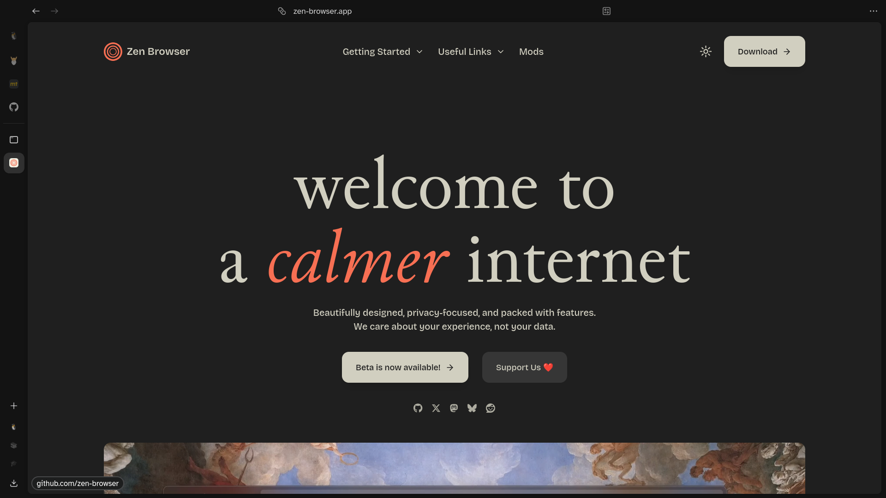
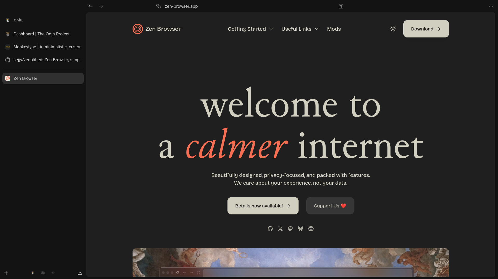

<div align="center">

## 🌀 zenplified

Zen Browser, simplified.

|  |
| :------------------------------------------------: |

|  |
| :----------------------------------------------: |

</div>

#

### Installation

1. **Enable user stylesheets**

	i. Enter `about:config` in the URL bar.

	ii. Search for `toolkit.legacyUserProfileCustomizations.stylesheets` and set it to `true`.

2. **Get the configuration files**

	i. Enter `about:support` in the URL bar.

	ii. Find **Profile Directory** and copy the path next to the **Open Directory** button.

	iii. Go to that directory:

	```bash
	cd path/to/profile/directory
	```

	iv. Clone the repository into a new directory named `chrome`:

	```bash
	git clone https://github.com/sejjy/zenplified.git chrome
	```

3. **Restart Zen Browser** to apply the changes.
