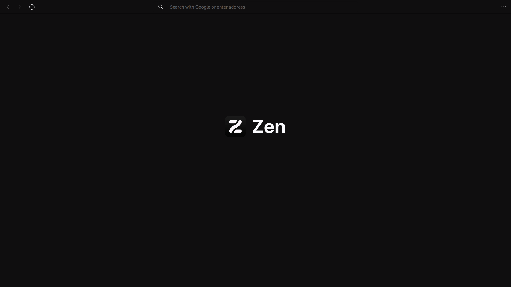
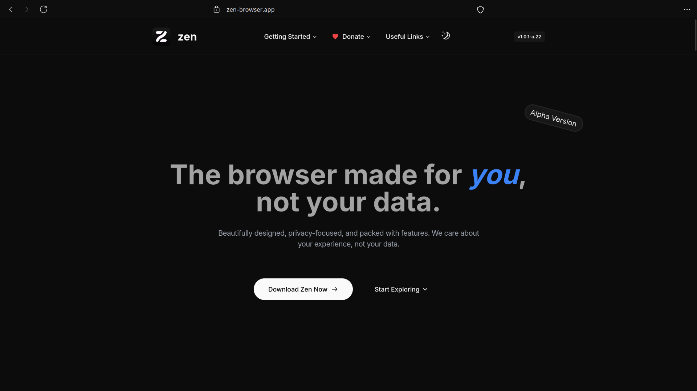
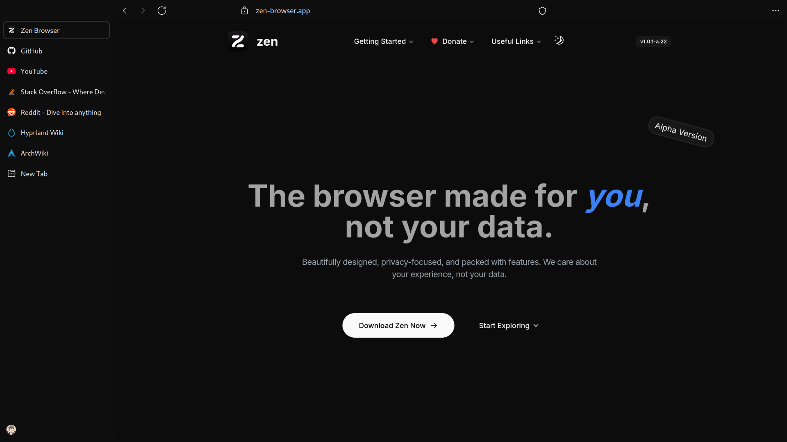
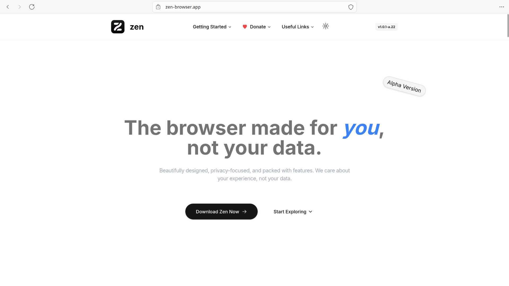
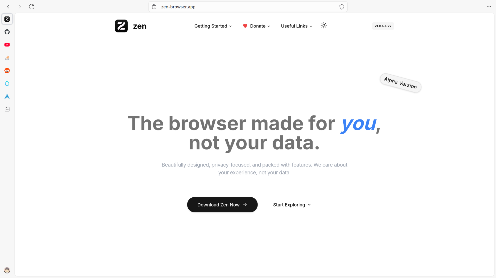
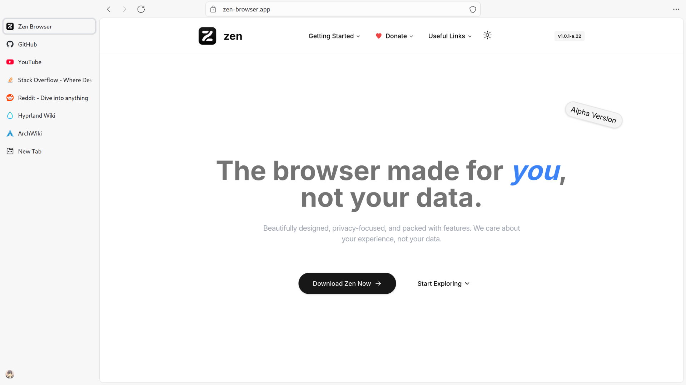

  # Zenplified 🌐

<table>
  <tr>
    <td>
      
    </td>
  </tr>
</table>

  

    
<strong>&nbsp;🌙 Dark Theme</strong>

     

  |                    Compact Mode                    |
  | :------------------------------------------------: |
  |  |

  |                      Collapsed Sidebar                       |
  | :----------------------------------------------------------: |
  |  |

  |                      Expanded Sidebar                      |
  | :--------------------------------------------------------: |
  |  |

  

  

    
<strong>&nbsp;☀️ Light Theme</strong>

     

  |                     Compact Mode                     |
  | :--------------------------------------------------: |
  |  |

  |                       Collapsed Sidebar                        |
  | :------------------------------------------------------------: |
  |  |

  |                       Expanded Sidebar                       |
  | :----------------------------------------------------------: |
  |  |

  

## Roadmap

- [ ] Light theme for **homepage**, **new windows**, and **new tabs**.
