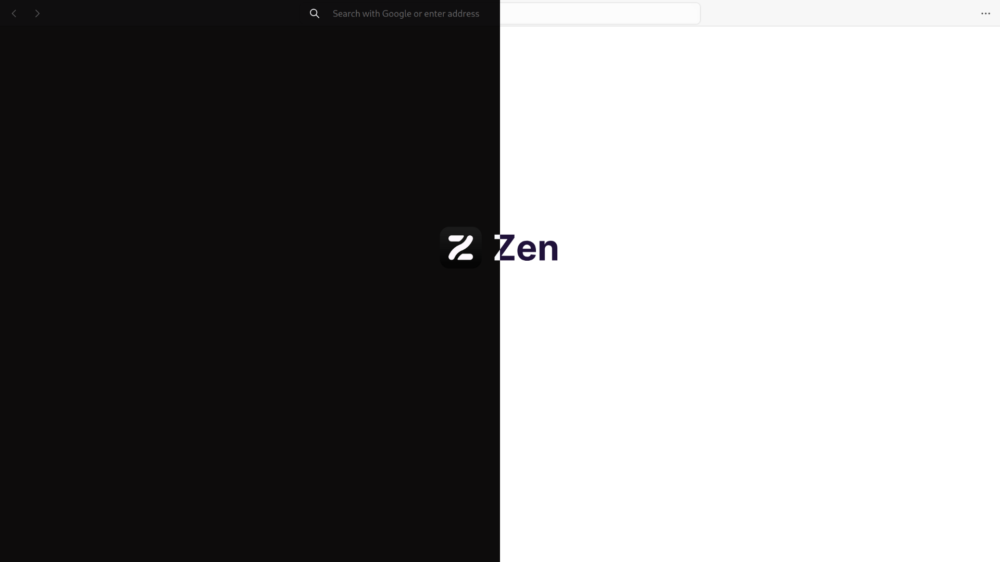
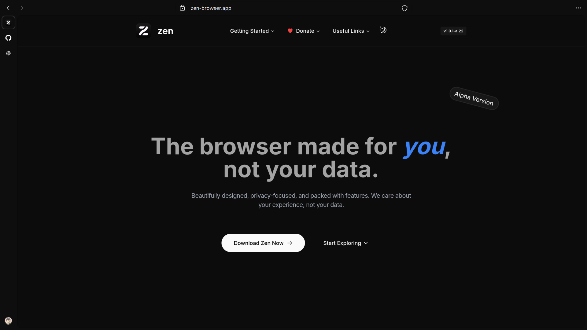
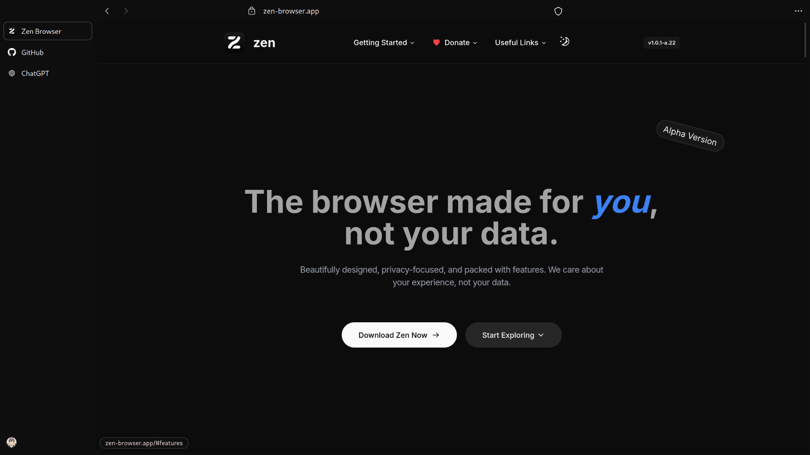
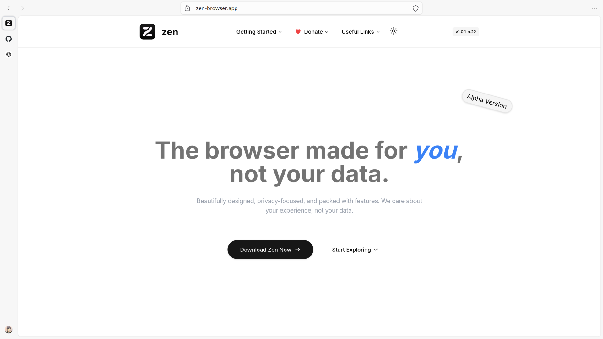
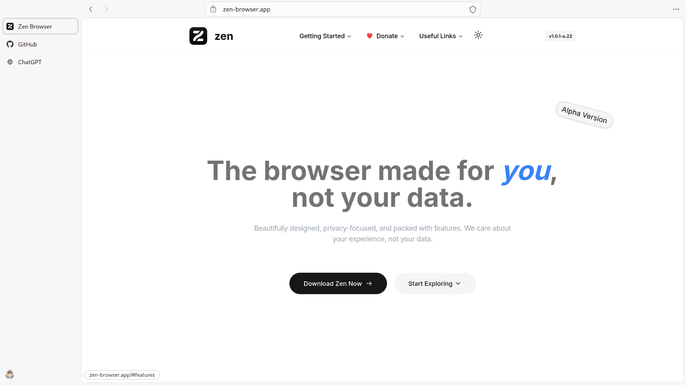

<div align="center">

# Zenplified 🌐

  <p style="font-size: 0.75em">Mozilla Zen 1.0.1-a.22</p>

  <table>
    <tr>
      <td>
        
      </td>
    </tr>
  </table>

  <details>
    <summary><strong>&nbsp;🌜 Dark Theme</strong></summary>
    <br />

|                  Collapsed Sidebar                   |
| :--------------------------------------------------: |
|  |

|                  Expanded Sidebar                  |
| :------------------------------------------------: |
|  |

  </details>

  <details>
    <summary><strong>&nbsp;🌞 Light Theme</strong></summary>
    <br />

|                   Collapsed Sidebar                    |
| :----------------------------------------------------: |
|  |

|                   Expanded Sidebar                   |
| :--------------------------------------------------: |
|  |

  </details>
</div>
<br />

## Setting up Zenplified

### Step 1. Clone the Repository

```bash
git clone https://github.com/sejjy/zenplified.git
cd zenplified
```

### Step 2. Enable User Stylesheets

1.  Type `about:config` in the address bar and press Enter.
2.  Search for `toolkit.legacyUserProfileCustomizations.stylesheets` and set it to `true`.

### Step 3. Copy Configuration Files

1.  Type `about:support` in the address bar and press Enter.
2.  Under **Application Basics**, find **Profile Directory** and click **Open Directory**.
3.  Create a new folder named `chrome`.
4.  Inside, paste the `userChrome.css` and `userContent.css` files from the `zenplified` folder.

Restart Zen Browser to apply the changes.

<br />

## Roadmap

- [x] Light theme for **homepage**, **new windows**, and **new tabs**
- [ ] Publish **Zenplified**
