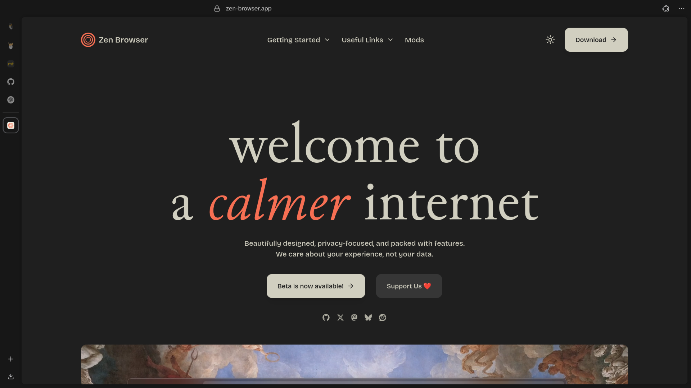
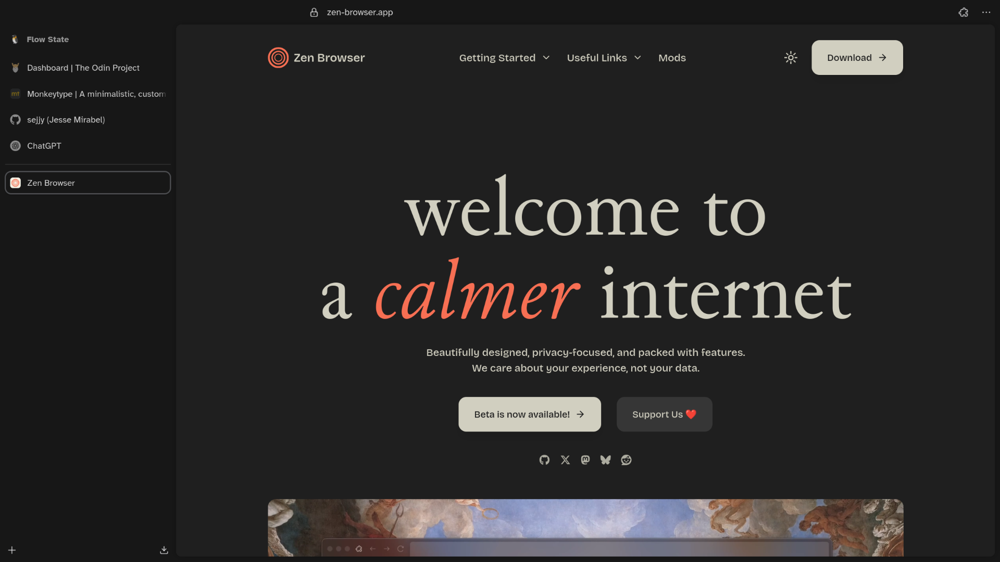

<div align="center">

## 🌀 zenplified

|  |
| :------------------------------------------------: |

|  |
| :----------------------------------------------: |

</div>

#

### Setting up zenplified

#### Step 1. Clone the repository

```bash
git clone https://github.com/sejjy/zenplified.git
cd zenplified
```

#### Step 2. Enable user stylesheets

1.  Type `about:config` in the address bar and press Enter.
2.  Search for `toolkit.legacyUserProfileCustomizations.stylesheets` and set it to `true`.

#### Step 3. Copy configuration files

1.  Type `about:support` in the address bar and press Enter.
2.  Under **Application Basics**, find **Profile Directory** and click **Open Directory**.
3.  Create a new folder named `chrome`.
4.  Inside, paste the `userChrome.css` and `userContent.css` files from the `zenplified` folder.

Restart Zen Browser to apply the changes.

#

### Roadmap

- [ ] Publish **zenplified**
