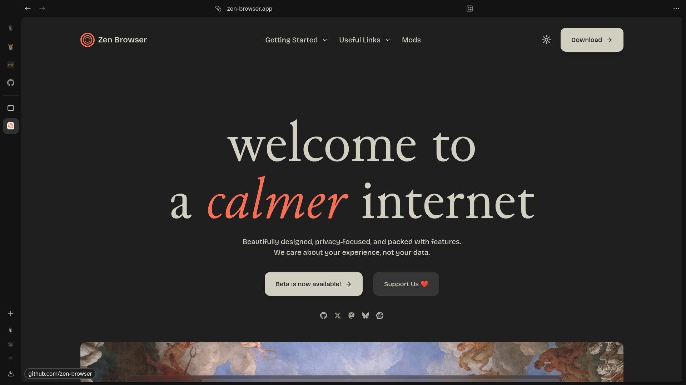
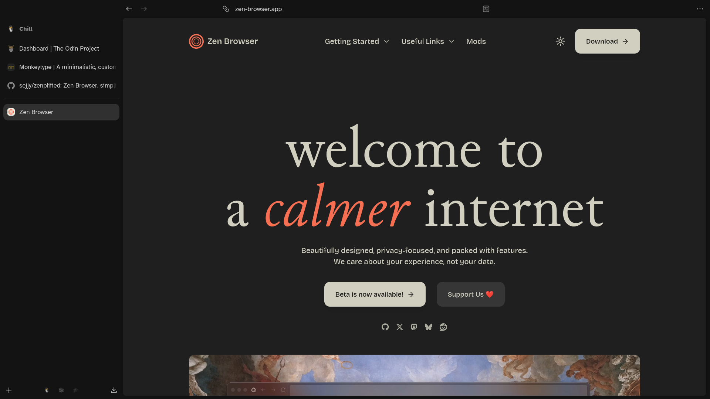

<div align="center">

## 🌀 zenplified

**Zen** Browser, sim**plified**

|  |
| :-------------------------------------------: |

|  |
| :-----------------------------------------: |

</div>

#

### How to install

#### Step 1: Enable user stylesheets

1. Enter `about:config` in the URL bar.

2. Search for `toolkit.legacyUserProfileCustomizations.stylesheets` and set it to `true`.

#### Step 2: Access the profile directory

1. Enter `about:support` in the URL bar.

2. Look for **Profile Directory** and click on **Open Directory**.

#### Step 3: Get the configuration files

1. Clone the repository into a new directory named `chrome`:

	```bash
	git clone https://github.com/sejjy/zenplified.git chrome
	```

2. Restart Zen Browser to apply the changes.

#

### References

- [Live Editing Zen Theme ↗](https://docs.zen-browser.app/guides/live-editing)
