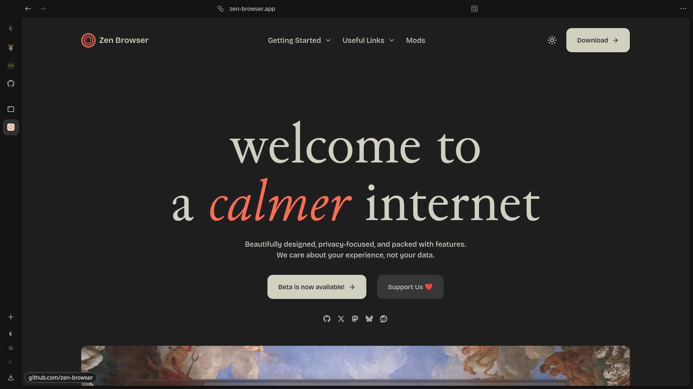
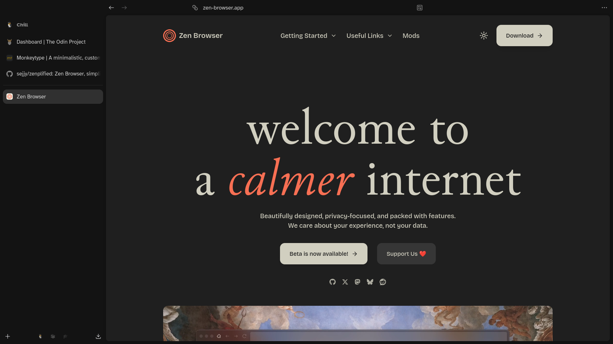

<div align="center">

## 🌀 zenplified

<ins><b>Zen</b></ins> Browser, sim<ins><b>plified</b></ins>

|  |
| :-------------------------------------------: |

|  |
| :-----------------------------------------: |

</div>

#

### How to install

#### Enable user stylesheets

1. Enter `about:config` in the URL bar.

2. Search for `toolkit.legacyUserProfileCustomizations.stylesheets` and set it to `true`.

#### Access the profile directory

1. Enter `about:support` in the URL bar.

2. Look for <ins><b>Profile Directory</b></ins> and click on <ins><b>Open Directory</b></ins>.

#### Get the configuration files

1. Clone the repository into a new directory named <ins><b>chrome</b></ins>:

	```bash
	git clone https://github.com/sejjy/zenplified.git chrome
	```

2. Restart Zen Browser to apply the changes.

#

### References

- [Live Editing Zen Theme ↗](https://docs.zen-browser.app/guides/live-editing)
